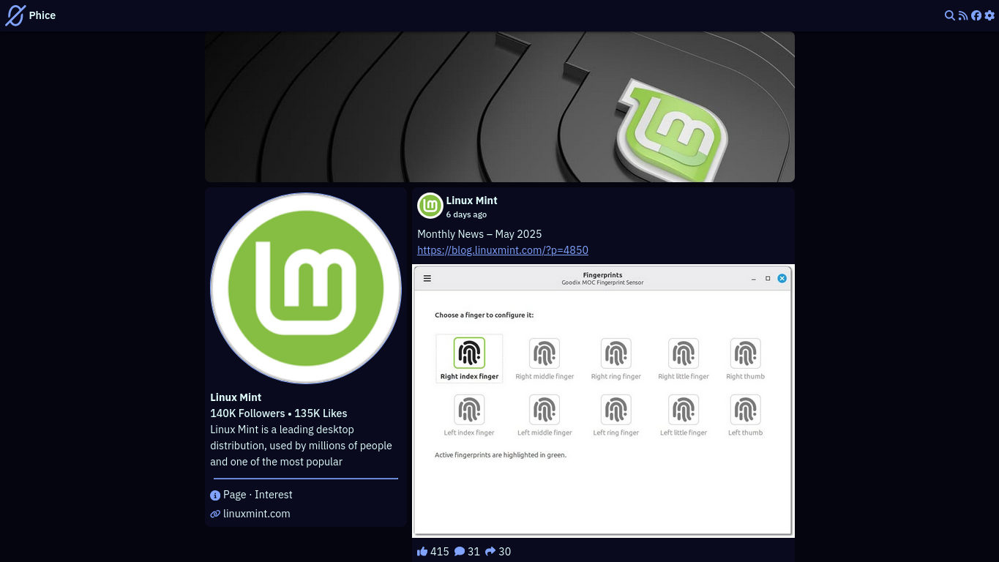

# Phice

A lightweight privacy-friendly alternative front-end for Facebook.

Inspired by projects like [Nitter](https://github.com/zedeus/nitter), [Invidious](https://github.com/iv-org/invidious) and others

# Screenshot



# Features

- Free and open-source
- Lightweight
- No ADS
- No JavaScript required
- No account required
- No trackers
- RSS feeds

# Installation

## Docker

Docker image avaliable at: https://hub.docker.com/r/c4ffe14e/phice

or build your image with:

```sh
docker buildx build -t phice:latest .
```

Create a config file (optional):

```sh
cp config.example.toml config.toml
```

Run it with docker:

```sh
docker run --rm -v "./config.toml:/src/phice/config.toml:ro" -p "5000:5000" -d phice:latest
```

or with compose:

```sh
docker-compose up -d
```

## Manual

### Dependencies:

- python >= 3.13
- uv

Fetch project dependencies:

```sh
uv sync
```

Create a config file (optional):

```sh
cp config.example.toml config.toml
```

And start your server:

```sh
uv run gunicorn -b 0.0.0.0:5000 -w 4 "app:app"
```

# Mirrors

[Codeberg](https://codeberg.org/c4ffe14e/phice)

[GitHub](https://github.com/c4ffe14e/phice)

[GitLab](https://gitlab.com/c4ffe14e/phice)
